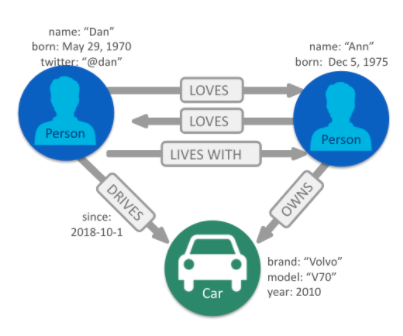
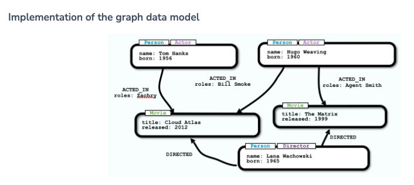

### What is a graph?
A graph is a set of discrete objects, each of which has some set of relationships with the other objects.

We care about graphs because any dataset can be represented as a graph. Any structure or concept, no matter how simple or complex, can be broken down into a set constituent parts that have some relationship to one another.
Mainly, graphs are uniquely useful when answering a question that involves following a path along a chain of related items.


### Neo4j’s property graph
The components of a Neo4j graph include:
- Nodes 
- Relationships 
- Labels 
- Properties

Graph terminology and Neo4j’s property graph
- Node = Vertex - an object in a graph
- Relationship = Edge - a connection between two vertices

### Nodes 
- Represent objects or entities. 
- Can be labeled.

There are two kinds of data that can be associated with a node - labels and properties.
Labels provide categorical information. For example, here we have two Person nodes and one Car node.
These labels categorize these nodes, as a Person or a Car, but they don’t provide any specific information about a given node.
**Specific information** for a node is represented as properties which you will learn about soon.


### Node properties
- Represent objects or entities. 
- Can be labeled. 
- May have properties.

Properties are used to associate specific information with individual nodes.

Nodes do not need to have a label or any properties. However, in practice, a node almost always has at least one label and one or more properties.

### Relationships
- Must have a type. 
- Must have a direction.
For example, as we see here, the relationships have the types - DRIVES, OWNS, and LOVES. Each of these types captures how a relationship is used to relate two nodes.

### Relationship properties
- Must have a type. 
- Must have a direction. 
- May have properties.

Just like nodes, relationships can have properties that express specific attributes.
Here we see the property ‘since’ for the DRIVES relationship. This indicates how long Dan has been driving this particular car.


### Multiple relationships
- Must have a type. 
- Must have a direction. 
- May have properties. 
- Nodes can share multiple relationships.

Because relationships are specific, each node can have many relationships with other nodes to fully capture their context.


### A property graph model

**Nodes**
- Represent objects or entities. 
- Can be labeled. 
- May have properties.

**Relationships**
- Must have a type.
- Must have a direction.
- May have properties.

**Nodes can share multiple relationships.**



Since the entire point of modeling data as a graph is to traverse a chain of linked nodes. One useful way of thinking about nodes is that they are waypoints along the traversal route. They contain the information needed to decide which links are good ones to follow, and which can be ignored. Relationships are those links.
This provides a flexible way of defining varying amounts of data.

### Traversing a graph
An important feature of graphs is to follow a chain of nodes and relationships.
The process of finding such routes is the definition of traversal.
We’ll be looking at 3 different ways that traversal can be done:
- Walk 
- Trail 
- Path


#### Traversing a graph: Walk
A walk is the most basic type of traversal. A walk is an ordered alternating list of nodes and relationships. For example, in the graph shown here, we could define a walk starting at node 1, hopping to 2, then 3, back to 2, on to 6, and back to 2. There are no restrictions - You can traverse relationships multiple times and visit the same node as many times as you wish.

#### Traversing a graph: Trail

A trail is a walk where no relationships are repeated, but nodes can be visited more than once.

The walk we just performed (1-2-3-2-6-2) is not a valid trail, because we traversed the relationship between 2 and 3 twice.
Instead, a valid trail, as shown here, could start at 1, go to 2, 6, and back to 2. This is permitted since there are two relationships between 6 and 2, and we use each of them once.


#### Traversing a graph: Path
A path is a trail where no nodes are repeated. That is, all items are unique.


The problems we solve with Neo4j are almost exclusively done by traversing trails and paths. Each of these terms mean something very specific in the context of graphs.
For example, there are several special kinds of paths that are extremely useful for solving certain problems. Shortest path (the path containing the fewest elements) is the most common of these.


### What is a graph database?
A graph database is an online database management system with Create, Read, Update, and Delete (CRUD) operations working on a graph data model.

Unlike other databases, relationships take first priority in graph databases. This means your application doesn’t have to infer data connections using foreign keys or out-of-band processing, such as MapReduce. By assembling the simple abstractions of nodes and relationships into connected structures, graph databases enable us to build sophisticated models that map closely to our problem domain. Data scientists can use the relationships in a data model to help enterprises make important business decisions.

**Neo4j is a native graph database**
See [this video](https://youtu.be/urO5FyP9PoI) for seeing the benefits of using the native graph database, Neo4j.


#### Querying using Cypher is intuitive

SQL statement - listing the employees in the IT Department:

~~~~sql
SELECT name FROM Person
LEFT JOIN Person_Department
  ON Person.Id = Person_Department.PersonId
LEFT JOIN Department
  ON Department.Id = Person_Department.DepartmentId
WHERE Department.name = "IT Department"
~~~~

Cypher 
```
MATCH (p:Person)<-[:EMPLOYEE]-(d:Department)
WHERE d.name = "IT Department"
RETURN p.name
````

#### Implementation of the graph data model




